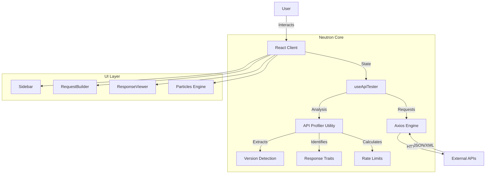

# Neutron API Tester | Universal API Analysis Tool

  

**Neutron** is a professional-grade, browser-based API testing environment designed for developers who need instant analysis, deep profiling, and a premium user experience without the bloat of legacy tools.

[**Launch Live App 🚀**](https://neutron-api-tester.netlify.app)

---

## 🌟 Key Features

- **🛡️ Universal API Profiling**: Automatically detects API versions, server types, and rate limit boundaries.
- **✨ Professional UI**: Glassmorphism aesthetic with ambient particle backgrounds and fluid animations.
- **📱 Fully Responsive**: Optimized layouts for Desktop, Tablet, and Mobile devices.
- **⚡ Real-Time Metrics**: Instant latency tracking, payload size analysis, and status monitoring.
- **🔐 Advanced Auth**: Support for Bearer Tokens, API Keys, and Basic Auth with secure styling.
- **🚀 One-Click Examples**: Pre-loaded with Google API configurations for instant onboarding.

---

## 🏗️ Architecture

Neutron is built on a modern React + Vite stack, leveraging Tailwind v4 for styling and Framer Motion for interactions.



---

## 📖 User Manual

### 1. The Workspace
The interface is divided into three main zones:
- **Sidebar**: Access history and organized collections (Desktop only).
- **Request Panel**: Configure URL, Method, Params, Headers, and Body.
- **Response Panel**: View formatted JSON, status codes, and profiling insights.

### 2. Making a Request
1. **Method**: Select GET, POST, PUT, DELETE, etc.
2. **URL**: Enter the full endpoint URL.
3. **Params**: Add query parameters in the Key-Value editor.
4. **Auth**: Choose Bearer, Basic, or API Key in the Auth tab.
5. **Send**: Click the gradient "Send" button or press `Enter`.

### 3. Analyzing Responses
Neutron automatically adds "Smart Chips" to the response footer:
- **Version**: e.g., `v1`, `v2` (detected from URL or Headers).
- **Server**: e.g., `cloudflare`, `google-frontend`.
- **Limits**: Shows remaining rate limit requests if headers are present.

### 4. Advanced Features
- **Copy/Download**: Hover over the response to Copy to Clipboard or Download as JSON.
- **Quick Start**: Use the "Welcome Panel" to load example Google API configurations instantly.

---

## 🛠️ Development Setup

```bash
# Clone the repository
git clone https://github.com/your-username/neutron-api-tester.git

# Install dependencies
npm install

# Start development server
npm run dev

# Build for production
npm run build
```

---

## 🎨 Design System

Neutron uses a custom design system built on Tailwind CSS.

| Component | Style Token | Description |
|-----------|-------------|-------------|
| **Background** | `bg-slate-950` | Deep space theme foundation |
| **Glass** | `backdrop-blur-xl bg-white/5` | Frosted glass effect for panels |
| **Accent** | `blue-500` to `indigo-600` | Primary gradient for actions |
| **Success** | `emerald-400` | Status codes 2xx and valid states |
| **Error** | `rose-400` | Status codes 4xx/5xx |

---

## 🔄 Use Cases

### Scenario A: Debugging a Rate Limited API
> **User Action**: Sends a request to `api.github.com`.
> **Neutron Response**:
> - Status: `200 OK`
> - Profiler Badge: `LIMIT: 4980` (Extracts `x-ratelimit-remaining`)
> - **Benefit**: Developer instantly sees how many requests they have left without checking headers manually.

### Scenario B: Testing Mobile Layout
> **User Action**: Opens Neutron on an iPad.
> **Neutron Layout**:
> - Sidebar automatically hides.
> - Request/Response panels stack vertically.
> - **Benefit**: Seamless coding experience on the go.

---

*(c) 2026 Neutron Dev Team. MIT License.*


---

## 📜 License & Commercial Use Terms

This project is licensed under a **Dual-License Model**:
- **Individual/Non-Commercial Use**: Granted under the terms of the MIT License. You are free to view, fork, and test the repository for personal research, educational projects, or non-profit use.
- **Commercial/Professional Use**: Strictly prohibited without formal authorization. To use this codebase, integrate its modules into commercial platforms, or leverage its proprietary elements for corporate deliverables, you must obtain a commercial license.

### ✉️ Contact for Licensing & Collaborations:
For commercial inquiries, licensing agreements, or bespoke system consulting, please reach out via:
- **Email**: [gajjarswetang@gmail.com](mailto:gajjarswetang@gmail.com)
- **LinkedIn**: [Swetang Gajjar on LinkedIn](https://www.linkedin.com/in/gajjarswetang/)
